# แผนผังสถาปัตยกรรมระบบ (System Architecture)

**ระบบประเมินความพร้อมการเข้าจดทะเบียนในตลาดหลักทรัพย์ (IPO Readiness Assessment)**

---

## 1. สถาปัตยกรรมระดับสูง (High-Level Architecture)

ระบบเป็นแบบ **Client–Server** แบ่งเป็น 3 ชั้นหลัก: ชั้นนำเสนอ (Frontend), ชั้นประมวลผล (Backend API), และชั้นข้อมูล (Database).

```mermaid
flowchart TB
    subgraph Client["🖥️ Client (Browser)"]
        UI[Frontend React App]
    end

    subgraph Server["☁️ Backend (Render / Local)"]
        API[Flask REST API]
    end

    subgraph Data["💾 Data Layer"]
        DB[(PostgreSQL / SQLite)]
    end

    UI <-->|HTTPS / REST| API
    API <-->|SQL| DB
```



---

## 2. โครงสร้างชั้นต่างๆ (Layered View)

```mermaid
flowchart LR
    subgraph Presentation["ชั้นนำเสนอ (Presentation)"]
        A[React + Vite]
        A --> A1[Home]
        A --> A2[Assessment]
        A --> A3[AssessmentReport]
        A --> A4[ProgressReport]
        A --> A5[DocumentChecklist]
        A --> A6[AuditLogs]
        A --> A7[Admin]
    end

    subgraph Application["ชั้นประมวลผล (Application)"]
        B[Flask app.py]
        B --> B1[/api/analyze]
        B --> B2[/api/assessments]
        B --> B3[/api/auth]
        B --> B4[/api/admin]
        B --> B5[/api/dashboard]
    end

    subgraph Business["ชั้นธุรกิจ (Services)"]
        C1[parser_thai]
        C2[metrics_engine]
        C3[dashboard_service]
        C4[user_service]
        C5[audit_service]
    end

    subgraph DataLayer["ชั้นข้อมูล (Data)"]
        D[db_helper]
        D --> E[(users)]
        D --> F[(assessments)]
        D --> G[(projects)]
        D --> H[(audit_logs)]
    end

    Presentation --> Application
    Application --> Business
    Business --> DataLayer
```

---

## 3. สถาปัตยกรรมส่วน Backend (Backend Components)

```mermaid
flowchart TB
    subgraph API["Flask API (app.py)"]
        R1[POST /api/analyze]
        R2[GET|POST /api/dashboard/assessments]
        R3[POST /api/assessments/save]
        R4[POST /api/auth/login]
        R5[GET|POST /api/admin/users]
        R6[GET /api/admin/audit-logs]
    end

    subgraph Services["ipo_readiness/services"]
        P[parser_thai.py<br/>ดึงข้อมูลจาก Excel]
        M[metrics_engine.py<br/>เกณฑ์ SET/mai, คะแนนสุขภาพ]
        D[dashboard_service.py<br/>assessments, projects, team]
        U[user_service.py<br/>users, auth]
        A[audit_service.py<br/>audit logs]
        DBH[db_helper.py<br/>SQLite / PostgreSQL]
    end

    R1 --> P
    R1 --> M
    R2 --> D
    R3 --> D
    R4 --> U
    R5 --> U
    R6 --> A

    P --> M
    D --> DBH
    U --> DBH
    A --> DBH
```

---

## 4. โครงสร้างส่วน Frontend (Frontend Components)


---

## 5. โฟลว์การประเมินความพร้อม IPO (Main Use Case Flow)

```mermaid
sequenceDiagram
    participant U as ผู้ใช้
    participant F as Frontend
    participant API as Backend API
    participant P as parser_thai
    participant M as metrics_engine
    participant D as dashboard_service
    participant DB as Database

    U->>F: อัปโหลดไฟล์ Excel
    F->>API: POST /api/analyze (workbooks)
    API->>P: parse_financial_files()
    P-->>API: data (งบดุล, งบกำไร, อัตราส่วน)
    API->>M: compute_metrics(data)
    M->>M: เกณฑ์ SET/mai, คะแนนสุขภาพ
    M-->>API: metrics
    API-->>F: { data, metrics }
    F-->>U: แสดงผลประเมิน + คำแนะนำ

    U->>F: กดบันทึกผล
    F->>API: POST /api/assessments/save (data, metrics, user_id)
    API->>D: save_assessment_and_create_project()
    D->>DB: INSERT assessments, projects
    D-->>API: project
    API-->>F: 201 Created
```



---

## 6. โครงสร้างฐานข้อมูล (Data Model)

```mermaid
erDiagram
    users ||--o{ assessments : "ทำการประเมิน"
    users {
        int id PK
        string name
        string email
        string role
        string password_hash
    }

    assessments ||--o| projects : "สร้างโปรเจกต์"
    assessments {
        int id PK
        string company_name
        int user_id FK
        int readiness_score
        string phase
        string status
        string risk
        text metrics_json
    }

    projects {
        int id PK
        string client
        int user_id FK
        int readiness
        string phase
        string status
    }

    audit_logs {
        int id PK
        int user_id
        string action
        text details
    }
```



---

## 7. สถาปัตยกรรมการ Deploy (Production)

```mermaid
flowchart LR
    subgraph User["ผู้ใช้"]
        Browser[Browser]
    end

    subgraph Vercel["Vercel (Frontend)"]
        SPA[Static React Build]
    end

    subgraph Render["Render (Backend)"]
        Flask[Flask + Gunicorn]
    end

    subgraph RenderDB["Render PostgreSQL"]
        PG[(PostgreSQL)]
    end

    Browser --> SPA
    Browser --> Flask
    Flask --> PG
```



| ส่วน | เทคโนโลยี | โฮสต์ |
|------|-----------|--------|
| Frontend | React, Vite | Vercel |
| Backend | Flask, Gunicorn, Python | Render (Web Service) |
| Database | PostgreSQL | Render (PostgreSQL) |
| การเชื่อมต่อ | REST API, CORS | HTTPS |

---

## 8. สรุปเทคโนโลยี (Technology Stack)

| ชั้น | เทคโนโลยี |
|------|-----------|
| **Frontend** | React 18, Vite, CSS |
| **Backend** | Python 3, Flask, Gunicorn |
| **Database** | SQLite (พัฒนา) / PostgreSQL (production) |
| **Library หลัก** | pandas, openpyxl, xlrd (Excel), psycopg2-binary |
| **Deploy** | Vercel (frontend), Render (backend + DB) |

---

*เอกสารนี้ใช้ Mermaid สำหรับ diagram — แสดงผลได้ใน GitHub, GitLab, และเครื่องมือที่รองรับ Mermaid*
